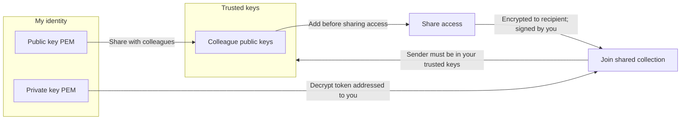

# Sharing Keys

HarborClient uses RSA key pairs to sign and encrypt **collection share tokens** — the tokens you send when sharing a live remote collection with a colleague. Open **File → Sharing Keys** to manage your identity and the public keys you trust.

This is separate from **Settings → SSL certificate verification**, which controls whether HTTP requests reject invalid TLS certificates. The keys on this page are for sharing security only.

The Sharing Keys panel has two sections: **My identity** (your key pair) and **Trusted keys** (public keys of people you trust).

## My identity

HarborClient creates a 2048-bit RSA key pair the first time you need one — for example, when you open Sharing Keys or create a share token. Your key pair is stored locally in the application data directory as `sharing-key.pem` (private) and `sharing-pub.pem` (public).

Your key pair serves two roles:

- **Sign share tokens you send** — recipients can verify the token came from you
- **Decrypt tokens addressed to you** — only your private key can read tokens encrypted to your public key

The **My identity** section shows:

| Field | Description |
| --- | --- |
| **Fingerprint** | SHA-256 hash of your public key. Use it to confirm you and a colleague are referring to the same key. |
| **Public key** | PEM-encoded RSA public key. Safe to share — colleagues need it to send you share tokens. |

## Exporting your public key

Share your public key so collaborators can add you as a trusted recipient and encrypt share tokens to you.

| Action | Description |
| --- | --- |
| **Copy public key** | Copies the PEM text to the clipboard |
| **Export public key** | Opens a save dialog; default filename `sharing-pub.pem` |

Send the copied text or the `.pem` file to your colleague over a channel you trust (email, chat, in person, and so on). Only share the **public** key — never your private key.

## Exporting and importing your key pair

Use these actions to back up your identity or move it to another machine.

| Action | Description |
| --- | --- |
| **Export private key** | Opens a save dialog; default filename `sharing-key.pem`. **Keep this file secret** — anyone with it can sign share tokens as you. |
| **Import key pair** | Opens a file picker for a private-key PEM file. Replaces your local key pair with the imported one. |

Import is useful when you set up HarborClient on a new computer and want to keep the same identity, or when restoring from a backup.

::: danger
Keep your private key secret. Anyone who has it can sign collection share tokens as you.
:::

## Trusted keys

The **Trusted keys** section lists public keys for people you trust. Trusted keys control who can send you share tokens and who you can share with.

| Rule | Description |
| --- | --- |
| **Incoming share tokens** | HarborClient only accepts tokens signed by a sender whose public key is in your trusted list. |
| **Outgoing share tokens** | When you create a share token, you must select a recipient from your trusted keys. The token is encrypted so only that person can decrypt it. |

Trusted keys are stored **per machine** in the local database. They are not synced through shared storage locations — each HarborClient installation maintains its own trust list.

### Adding a trusted key

| Action | Description |
| --- | --- |
| **Add trusted key** | Enter a **Label** (for example, `Alex`) and paste the colleague's public key PEM, then click **Add trusted key**. |
| **Import from file** | Enter a label first, then click **Import from file** and select a `.pem` file containing the public key. |

Each trusted key is listed with its label and fingerprint. Click **Delete** to remove a key. After removal, share tokens signed by that key will no longer be accepted, and you can no longer select that person as a share recipient.

If you try to create a share token without any trusted keys, HarborClient prompts you to add the recipient's public key under **File → Sharing Keys → Trusted keys** first.

## Working with collaborators

Before sending or joining shared collections, exchange public keys:

| Step | Who | Action |
| --- | --- | --- |
| 1 | You | Copy or export your public key from **My identity** and send it to your colleague |
| 2 | Colleague | Open **File → Sharing Keys → Trusted keys**, add your public key with a label |
| 3 | Colleague | Share their public key with you |
| 4 | You | Add their public key to your trusted keys |
| 5 | Either party | Follow [Sharing collections](/collections#sharing-collections) to share access or join a shared collection |

When sharing access, the sender opens the collection row menu → **Share access**, selects the recipient from the trusted-keys list, and copies the generated token. Share tokens expire after **seven days**.

When joining a shared collection, the recipient pastes the token under **Join shared collection**, then **restarts HarborClient** so the shared connection and collection load.

## Security notes

- **Public keys** are safe to share. **Private keys** must stay on your machine and out of chat logs or email.
- **Share tokens** embed storage connection credentials. Treat them like secrets and share only with the intended recipient over a trusted channel.
- **Share tokens expire** after seven days. Generate a new token if one expires before the recipient joins.

## What's next

- [Collections → Sharing collections](/collections#sharing-collections) — share access and join live remote collections
- [Settings → Storage Locations](/settings#storage-locations) — configure remote storage connections used by shared collections
