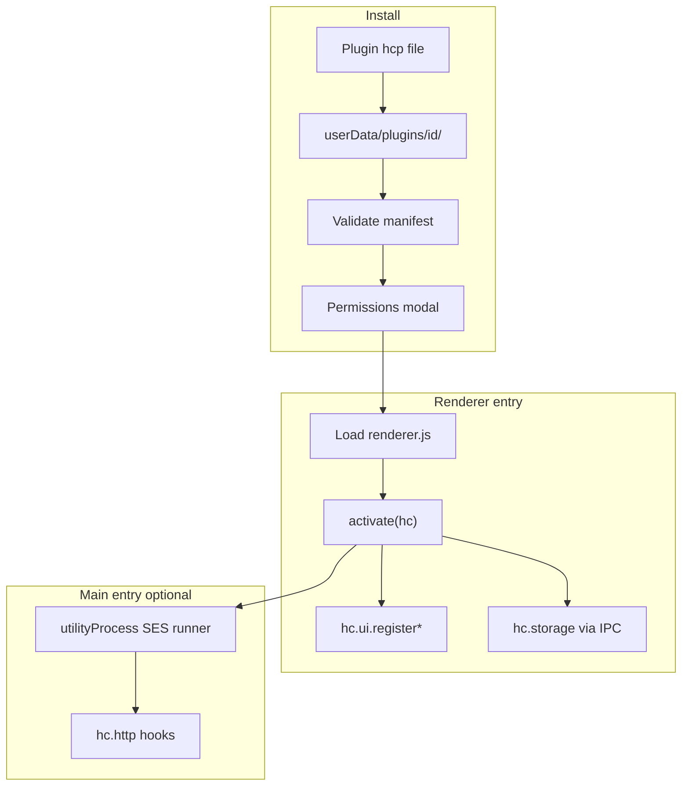
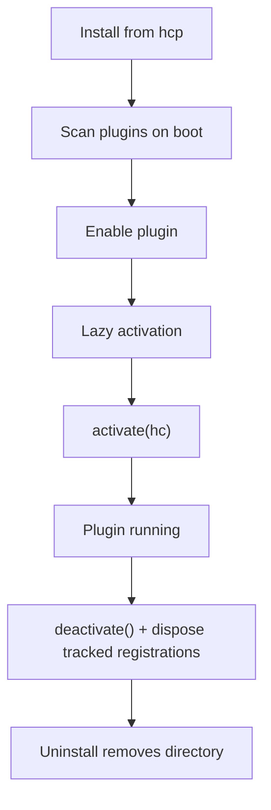

# Architecture

A HarborClient plugin is long-lived code the host loads into the desktop app. On activation, HarborClient imports your entry module and calls `activate(hc)`, passing the same `hc` API namespace used by [request scripts](https://harborclient.com/request-scripts) — but with a broader surface for UI, storage, HTTP hooks, and more.

Where that code actually runs is the **runtime**: the process and sandbox HarborClient starts for your entry. HarborClient is an Electron app, so UI and privileged background work live in different processes. Plugins follow the same split. Your `manifest.json` can declare a **renderer** entry, a **main** entry, or both, depending on what the plugin needs to do.

Most plugins only need the **renderer** runtime — React panels, tabs, and other UI that talk to the host over IPC. Add a **main** entry when you need HTTP lifecycle hooks, custom IPC handlers, or other background logic that should not run in the UI process. Theme-only packages can omit both entries.

## Two runtimes

| Entry        | Runs in              | Purpose                                   | Sandbox                                        |
| ------------ | -------------------- | ----------------------------------------- | ---------------------------------------------- |
| **renderer** | Renderer (React)     | Settings panels, sidebar UI, request tabs | No SES — `contextIsolation` plus IPC-only `hc` |
| **main**     | utilityProcess + SES | HTTP hooks, custom IPC, background logic  | SES `lockdown()` in the child process only     |

Renderer UI uses `hc.react`, the host's React instance. **Do not bundle React** in your plugin; the host installs it before `activate(hc)` runs. Use the JSX runtime documented in [React](/api/react).

Main-process plugin code reuses the same utilityProcess script runner infrastructure as [request scripts](https://harborclient.com/request-scripts). `lockdown()` runs only in that child process — never in the Electron main process or renderer.

## Lifecycle

1. **Install** — HarborClient unpacks the `.hcp` file to `userData/plugins/<id>/`, validates `manifest.json`, and shows a permissions confirmation dialog.
2. **Discovery** — On startup, HarborClient scans `plugins/*/manifest.json` for installed plugins and reloads any **unpacked** plugin paths saved from development sessions.
3. **Activation** — Plugins activate lazily (for example when the user opens a contributed settings section). The host loads the entry module and calls `activate(hc)`.
4. **Deactivation** — On disable or unload, the host tears down tracked registrations automatically, then calls `deactivate()` if exported.
5. **Uninstall** — Removes an installed plugin directory and clears stored enablement state. Unpacked plugins are removed from the dev registry only; your source folder on disk is not deleted.

Registrations from `hc.ui.*` and similar APIs return **disposables** that the host tracks automatically on deactivation. Dispose custom resources (timers, focus sync, etc.) in `deactivate()` or React effect cleanup.

See [Permissions](/manifest#permissions) for the capability model and [Dev workflow](/dev-workflow) for unpacked development loading.
