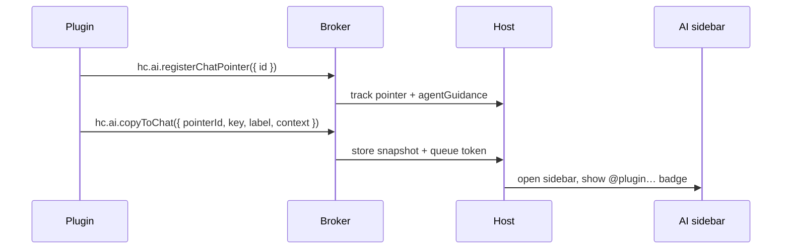

# Chat pointers

Use `hc.ai.registerChatPointer` and `hc.ai.copyToChat` when your plugin needs to insert a badged `@` reference into the AI sidebar composer — the same pattern Harbor uses for scripts, response sections, and terminal selections.



See [hc.ai](/renderer-data#hcai) for the API reference and [Permissions](/permissions) for the `ai` capability flag.

## Manifest

```json
{
  "id": "com.example.scripts",
  "name": "Example Scripts",
  "version": "1.0.0",
  "permissions": ["ai", "ui"]
}
```

Chat pointers are runtime-only — no `contributes` entry is required. Declare the `ai` permission so HarborClient shows it in the install confirmation dialog. Add `ui` when you also register toolbar actions or use `CopyToChatButton`.

## Activate

```js
export function activate(hc) {
  hc.ai.registerChatPointer({
    id: 'script',
    agentGuidance:
      'When a user message contains @plugin.com.example.scripts.script.<key>, prefer the captured script context in the system message.'
  });
}
```

## Copy selection to chat

```jsx
import { CodeEditor, CopyToChatButton } from '@harborclient/sdk/components';

function ScriptEditor({ scriptUuid, scriptName, source }) {
  return (
    <CodeEditor
      value={source}
      selectionToolbarActions={[
        {
          id: 'copy-to-chat',
          onSelect: ({ from, to, selectedText }) => {
            void hc.ai.copyToChat({
              pointerId: 'script',
              key: scriptUuid,
              label: scriptName,
              context: source,
              selection: { start: from, end: to }
            });
          }
        }
      ]}
    />
  );
}
```

Harbor builds the token `@plugin.com.example.scripts.script.<scriptUuid>#from.to`, stores your label/context snapshot, and inserts a badge into the composer. At send time the agent receives an ephemeral system message with the captured context.

## Notes

- **Register during `activate(hc)`** — call `hc.ai.registerChatPointer` once so `copyToChat` can validate the pointer id.
- **Snapshot at copy time** — resolve data in the plugin sandbox and pass `context` / `label`; the host does not call back into your plugin to expand tokens later.
- **Unload-safe history** — disposing the registration removes live agentGuidance, but badges on past messages still render from persisted `referenceSnapshots`.
