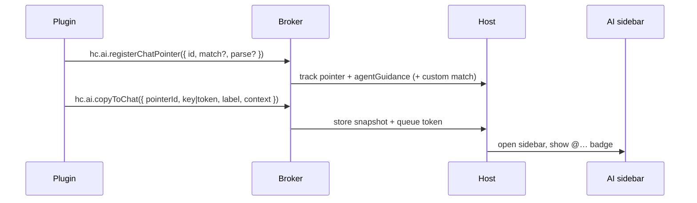

# Chat pointers

Use `hc.ai.registerChatPointer` and `hc.ai.copyToChat` when your plugin needs to insert a badged `@` reference into the AI sidebar composer — the same pattern Harbor uses for scripts, response sections, and terminal selections.



See [hc.ai](/api/ai) for the API reference and [Permissions](/manifest#permissions) for the `ai` capability flag. For always-on prompt fragments and per-turn hooks, see [AI instructions and turn hooks](/examples/ai-instructions-turn-hooks).

## Manifest

```json
{
  "id": "com.example.scripts",
  "name": "Example Scripts",
  "version": "1.0.0",
  "engines": { "harborclient": ">=2.8.8" },
  "renderer": "dist/renderer.js",
  "permissions": ["ai", "ui"]
}
```

Chat pointers are runtime-only — no `contributes` entry is required. Declare the `ai` permission so HarborClient shows it in the install confirmation dialog. Add `ui` when you also register toolbar actions or use `CopyToChatButton`.

## Default grammar

Omit `match` / `parse` to use the built-in `@plugin.<pluginId>.<id>.<key>` shape:

```js
export function activate(hc) {
  hc.ai.registerChatPointer({
    id: 'script',
    agentGuidance:
      'When a user message contains @plugin.com.example.scripts.script.<key>, prefer the captured script context in the system message.'
  });
}
```

## Custom match + parse

Supply both `match` (token body after `@`) and `parse` to invent a shape that does **not** collide with reserved builtins (`plugin`, `request`, `res`, `term`, `snippet`, `logs`, …):

```js
export function activate(hc) {
  hc.ai.registerChatPointer({
    id: 'invoice',
    match: /^invoice\.([A-Za-z0-9-]+)(?:#(\d+)\.(\d+))?/,
    parse: (match, fullToken, atIndex) => {
      const key = match[1];
      if (key == null) return null;
      return {
        key,
        selection:
          match[2] != null && match[3] != null
            ? { start: Number(match[2]), end: Number(match[3]) }
            : undefined
      };
    },
    agentGuidance: 'When @invoice.<id> appears, use the captured invoice context.'
  });
}
```

`parse` runs in your plugin webview. The host uses a sync fallback (capture group 1 as `key`, groups 2–3 as selection) for composer highlighting; your `parse` is re-invoked over IPC at copy and send/validate. Return `null` to reject a token at those points.

## Copy selection to chat

### Default grammar

```jsx
import { CodeEditor } from '@harborclient/sdk/components';

function ScriptEditor({ scriptUuid, scriptName, source }) {
  return (
    <CodeEditor
      value={source}
      selectionToolbarActions={[
        {
          id: 'copy-to-chat',
          onSelect: ({ from, to, selectedText }) => {
            void hc.ai.copyToChat({
              pointerId: 'script',
              key: scriptUuid,
              label: scriptName,
              context: source,
              selection: { start: from, end: to }
            });
          }
        }
      ]}
    />
  );
}
```

Harbor builds `@plugin.com.example.scripts.script.<scriptUuid>#from.to`, stores your label/context snapshot, and inserts a badge into the composer. Pair with [`CopyToChatButton`](/components/copy-to-chat-button) when you need a dedicated control outside the editor toolbar.

### Custom match

Pass the full `token` (including `@`) that matches your registered pattern:

```js
await hc.ai.copyToChat({
  pointerId: 'invoice',
  token: '@invoice.inv-42#0.12',
  label: 'Invoice inv-42',
  context: invoiceText,
  selection: { start: 0, end: 12 }
});
```

At send time the agent receives an ephemeral system message with the captured context.

## Notes

- **Register during `activate(hc)`** — call `hc.ai.registerChatPointer` once so `copyToChat` can validate the pointer id.
- **`match` and `parse` together** — provide both or neither.
- **Snapshot at copy time** — resolve data in the plugin sandbox and pass `context` / `label`; the host does not call back into your plugin to expand tokens later.
- **Unload-safe history** — disposing the registration removes live agentGuidance, but badges on past messages still render from persisted `referenceSnapshots`.
