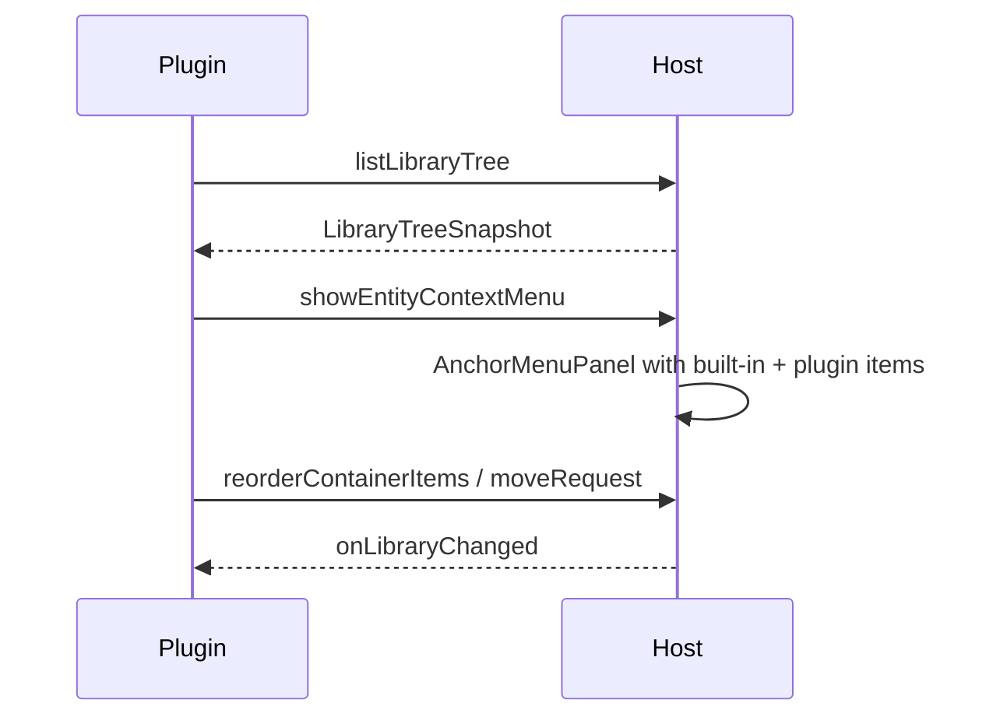

# Sidebar replacement tree

This example is a **renderer plugin** that replaces the built-in Collections
sidebar with a custom tree. It reads the library via `hc.host.listLibraryTree`,
opens host entity context menus, and commits reorder/move through host APIs.

Requires the `ui` permission and a `sidebarPanels` contribution with
`replaces: "collections"`.



## manifest.json

```json
{
  "id": "com.example.sidebar-tree",
  "name": "Example sidebar tree",
  "version": "1.0.0",
  "main": "dist/main.js",
  "renderer": "dist/renderer.js",
  "permissions": ["ui"],
  "contributes": {
    "sidebarPanels": [
      {
        "id": "collections",
        "title": "Example tree",
        "replaces": "collections",
        "order": 50
      }
    ],
    "commands": [{ "id": "example.ping", "title": "Ping from menu" }],
    "contextMenus": [
      {
        "id": "example.ping",
        "title": "Ping",
        "command": "example.ping",
        "when": ["collection", "folder", "request"]
      }
    ]
  }
}
```

## Activate and register the panel

```typescript
import type { PluginContext } from '@harborclient/sdk';
import { createRoot } from '@harborclient/sdk/react';
import { SidebarTreePanel } from './SidebarTreePanel';

export function activate(hc: PluginContext): void {
  hc.commands.register('example.ping', (target) => {
    hc.ui.showToast(`Ping ${JSON.stringify(target)}`);
  });

  hc.ui.registerSidebarPanel({
    id: 'collections',
    title: 'Example tree',
    Component: SidebarTreePanel
  });
}
```

`replaces` is **manifest-only** — do not pass it to `registerSidebarPanel`.

## Read the tree and listen for changes

```typescript
import type { LibraryTreeSnapshot, PluginContext } from '@harborclient/sdk';
import { useEffect, useState } from '@harborclient/sdk/react';

const PLUGIN_ID = 'com.example.sidebar-tree';
const CONTRIBUTION_ID = 'collections';

export function SidebarTreePanel({ hc }: { hc: PluginContext }) {
  const [tree, setTree] = useState<LibraryTreeSnapshot | null>(null);

  useEffect(() => {
    let cancelled = false;
    const reload = async () => {
      const next = await hc.host.listLibraryTree();
      if (!cancelled) setTree(next);
    };
    void reload();
    const stop = hc.host.onLibraryChanged(() => {
      void reload();
    });
    return () => {
      cancelled = true;
      stop.dispose();
    };
  }, [hc]);

  // …render SidebarFolderItem / SidebarRequestItem from tree
}
```

## Host-mediated context menus

On row right-click, ask the host to show the built-in menu (including your
`registerContextMenuItem` contributions):

```typescript
function onRowContextMenu(
  event: React.MouseEvent,
  target:
    | { type: 'collection'; collectionId: number }
    | { type: 'folder'; collectionId: number; folderId: number }
    | { type: 'request'; requestId: number }
): void {
  event.preventDefault();
  void hc.host.showEntityContextMenu({
    target,
    x: event.clientX,
    y: event.clientY,
    pluginId: PLUGIN_ID,
    contributionId: CONTRIBUTION_ID
  });
}
```

Coordinates are webview-local; the host maps them using the HostedSurface
bounds. Document targets are not supported.

## Keyboard reorder (Move up / Move down)

Use `buildReorderMenuGroup` from `@harborclient/sdk/components` in a plugin-owned
`RowActionsMenu`, then commit with host APIs:

```typescript
import { buildReorderMenuGroup } from '@harborclient/sdk/components';

const reorderGroups = buildReorderMenuGroup(index, siblings.length, async (direction) => {
  const next = [...orderedRequestIds];
  const from = index;
  const to = direction === 'up' ? index - 1 : index + 1;
  if (to < 0 || to >= next.length) return;
  const [moved] = next.splice(from, 1);
  next.splice(to, 0, moved);
  await hc.host.reorderRequests({
    collectionId,
    folderId,
    orderedRequestIds: next
  });
});
```

For mixed request + document lists, prefer:

```typescript
await hc.host.reorderContainerItems({
  collectionId,
  folderId,
  items: [
    { kind: 'request', id: 1 },
    { kind: 'document', id: 2 },
    { kind: 'request', id: 3 }
  ]
});
```

## Pointer drag-and-drop

The host does not inject a DnD library into plugin webviews. You may:

1. Use `SortableSidebarItem` from `@harborclient/sdk/components` (dnd-kit is an
   SDK dependency — no separate install), or
2. Implement your own pointer DnD.

On drag end, commit with `hc.host.moveRequest`, `hc.host.moveFolder`,
`hc.host.reorderContainerItems`, etc. Prefer reacting to `onLibraryChanged`
instead of manually merging optimistic state when the host refreshes.

```typescript
await hc.host.moveRequest({
  collectionId,
  requestId,
  folderId: targetFolderId,
  index: dropIndex
});
```

## Scrolling

The host mounts `sidebarPanels` with `resizeMode="fill"` and disables the outer
`Sidebar` scroll region, so the plugin owns scrolling. Use
`Scrollbars` from `@harborclient/sdk/components` — the same OverlayScrollbars
wrapper as the built-in Collections sidebar (`os-theme-harbor`, themed via host
`styles.css`).

Do **not** use `overflow-y-auto` / `overflow-auto` for the main sidebar list;
native OS scrollbars will not match HarborClient chrome.

Keep a fixed header (search/filter) outside the scroll region:

```tsx
import { FormGroup, Input, Scrollbars } from '@harborclient/sdk/components';

export function SidebarTreePanel({ hc }: { hc: PluginContext }) {
  // …load tree state…

  return (
    <div className="flex h-full min-h-0 flex-col">
      <div className="shrink-0 border-b border-separator px-2 py-3">
        <FormGroup bordered={false} label="Search collections" htmlFor="sidebar-filter" srOnly>
          <Input
            id="sidebar-filter"
            type="search"
            placeholder="Search"
            className="w-full"
            value={filter}
            onChange={(event) => setFilter(event.target.value)}
          />
        </FormGroup>
      </div>
      <Scrollbars autoHide className="min-h-0 flex-1">
        <div className="flex min-h-full min-w-0 flex-col">
          {/* SidebarFolderItem / SidebarRequestItem tree */}
        </div>
      </Scrollbars>
    </div>
  );
}
```

## Selection and open

Keep the host selection bridge and open APIs in sync:

```typescript
await hc.host.setSidebarSelection({
  kind: 'request',
  collectionId,
  folderId,
  requestId
});
await hc.host.loadRequest(requestId);
```

See [renderer-data](/renderer-data) for the full host API tables.
